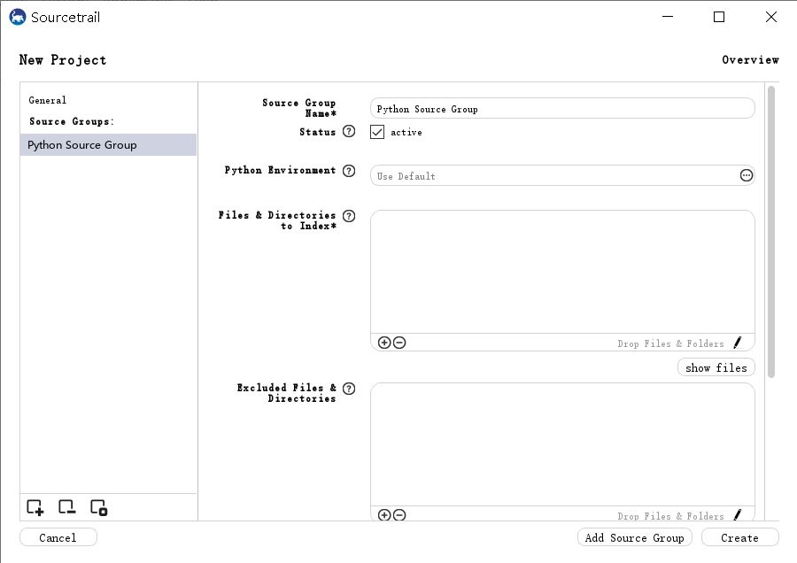

# Setup project

> Sourcetrail project consist of multiple **source groups**. Each source group uses a certain language, a set of files, and all configurations to index these files. There are different types of source groups for each supported programming language.

## Source Group Setup for Python

+ **Python Environment**

Here you can specify the path to the directory or to the executable of the (virtual) Python environment that should be used to resolve dependencies within the indexed source code.

You can make use of the environment variables with **${ENV_VAR}**.

+ **Files & Directories to index**

These paths define the files and directories that will be indexed by Sourcetrail. Provide a directory to recursively add all contained source and header files. If your project's source code resides in one location, but generated source files are kept at a different location, you will also need to add that directory.

+ **Source File Extensions**

Define the valid extensions for source file including the dot, e.g. `.py`. Sourcetrail will only try to index files that match one of these extensions.

